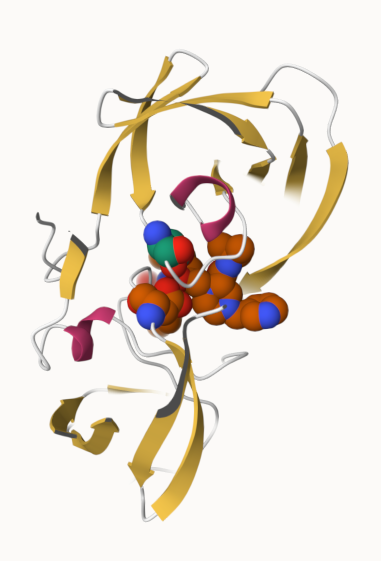
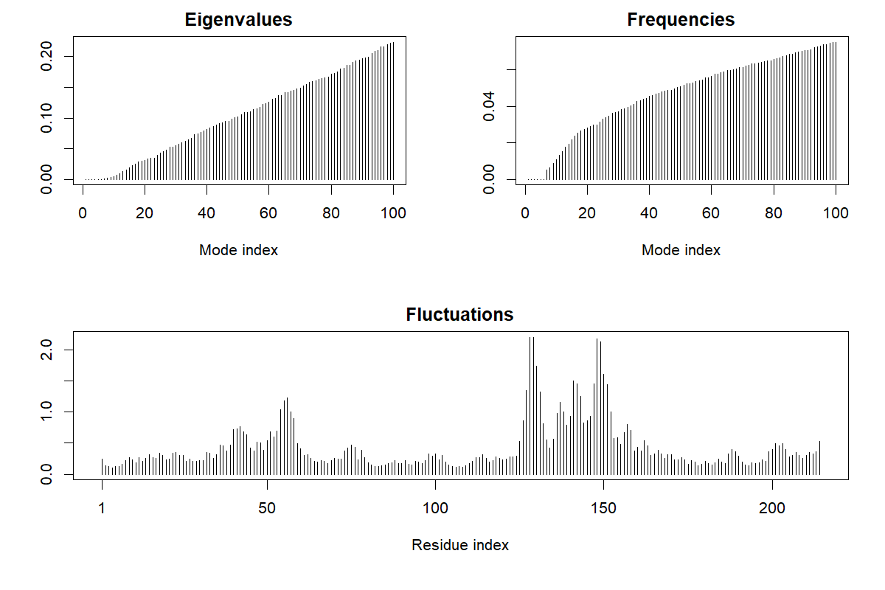
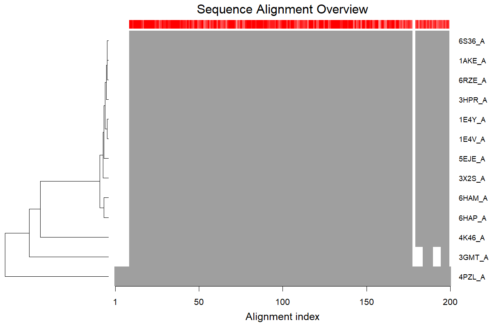

## Introduction to the RCSB Protein Data Bank (PDB)

```{r}
pdb_stats<- read.csv("Data Export Summary.csv")
```

```{r}
head(pdb_stats)
str(pdb_stats)

clean_numeric <- function(x) {
  as.numeric(gsub(",", "", x))
}
pdb_stats_clean <- pdb_stats
pdb_stats_clean[, 2:9] <- lapply(pdb_stats_clean[, 2:9], clean_numeric)

head(pdb_stats_clean)
```

>Q1. What percentage of structures in the PDB are solved by X-Ray and Electron Microscopy.

```{r}
total_structures <- sum(pdb_stats_clean$Total)
xray_structures <- sum(pdb_stats_clean$X.ray)

em_structures <- sum(pdb_stats_clean$EM)

xray_percent <- (xray_structures / total_structures) * 100
em_percent <- (em_structures / total_structures) * 100
combined_percent <- xray_percent + em_percent
print(xray_percent)
print(em_percent)
```
#X-Ray percent is 81.43% and Electron Microscopy is 12.27%.

>Q2. What proportion of structures in the PDB are protein?

```{r}
protein_only<-pdb_stats_clean[pdb_stats_clean$Molecular.Type=="Protein (only)", "Total"]
protein_proportion<-(protein_only/total_structures) * 100
print(protein_proportion)
```
#86.04% of structures in the PDB are proteins.

>Q3. Type HIV in the PDB website search box on the home page and determine how many HIV-1 protease structures are in the current PDB?

#There is approximately 1,150 HIV-1 protease structures in the current PDB.

```{r}
pdb_text<-readLines("1hsg.pdb")
head(pdb_text, 50)
atom_lines<-grep("^ATOM", pdb_text, value=TRUE)
head(atom_lines)
```

## Visualizing the HIV-1 protease structure

>Q4. Water molecules normally have 3 atoms. Why do we see just one atom per water molecule in this structure?

#We only see one atom per water molecule in this structure because this is the water molecule that is interacting with the other molecules; this is showing an interaction and not the whole picture.

>Q5. There is a critical "conserved" water molecule in the binding site. Can you identify this water molecule? What residue number does this water molecule have.

#Yes, W301; residue number is 301.

>Q6. Generate and save a figure clearly showing the two distinct chains of HIV-protease along with the ligand. You might also consider showing the catalytic residues ASP 25 in each chain and the critical water (we recommend “Ball & Stick” for these side-chains). 

```{r}

```

## Introduction to Bio3D in R

```{r}
library(bio3d)
```

```{r}
list.files()
pdb<-read.pdb("1HSG")
pdb
```

>Q7. How many amino acid residues are there is this pdb object?

#198 amino acid residues

>Q8. Name one of the two non-protein residues?

#HOH

>Q9. How many protein chains are in this structure?

#2

```{r}
attributes(pdb)
```

```{r}
head(pdb$atom)
```

```{r}
library(bio3d)
pdb<-read.pdb("1HSG")
pdb
```

```{r}
sele <- atom.select(pdb, resno=25)
print(sele)
```

```{r}
adk<- read.pdb("6s36")
adk
```

```{r}
m<-nma(adk)
```

```{r}
png("nma_plot.png", width=1200,height=800,res=150)
plot(m)
dev.off()

mktrj(m, file="adk_m7.pdb")
```

## Comparitive structure analysis of Adenylate Kinase

```{r}
library(bio3d)
```

>Q10. Which of the packages above is found only on BioConductor and not CRAN?

#msa

>Q11. Which of the above packages is not found on BioConductor or CRAN?

#bio3dview

>Q12. True or false? Functions from the pak package can be used to install packages from GitHub and BitBucket?

#TRUE

```{r}
library(bio3d)
aa<-get.seq("1ake_A")
aa
length(aa$ali)
```

>Q13. How many amino acids are in this sequence, i.e. how long is this sequence?

#214 amino acids in this sequence

```{r}
b<-blast.pdb(aa)
hits<-plot(b)
```

```{r}
hits<-NULL
hits$pdb.id<-c('1AKE_A','6S36_A','6RZE_A','3HPR_A','1E4V_A','5EJE_A','1E4Y_A','3X2S_A','6HAP_A','6HAM_A','4K46_A','3GMT_A','4PZL_A')
hits$pdb.id
```

```{r}
files<-get.pdb(hits$pdb.id, path="pdbs", split=TRUE,gzip=TRUE)
```

```{r}
pdbs<-pdbaln(files, web.args=list(email="ala021@ucsd.edu"))
saveRDS(pdbs, "pdbs_aligned.rds")
ids<-basename.pdb(pdbs$id)
png("alignment_plot.png", width=1200, height=800, res=150)
plot(pdbs, labels=ids)
dev.off()

```

```{r}
anno<-pdb.annotate(ids)
unique(anno$source)
anno
```

```{r}
pc.xray<-pca(pdbs)
plot(pc.xray)
```

```{r}
rd<-rmsd(pdbs)
hc.rd<-hclust(dist(rd))
grps.rd<-cutree(hc.rd, k=3)
plot(pc.xray, 1:2, col="grey50", bg=grps.rd, pch=21, cex=1)
```

## Optional further visualization

```{r}
pc1<-mktrj(pc.xray,pc=1, file="pc_1.pdb")
```

```{r}
library(ggplot2)
library(ggrepel)

df<-data.frame(PC1=pc.xray$z[,1],
               PC2=pc.xray$z[,2],
               col=as.factor(grps.rd),
               ids=ids)
p<-ggplot(df)+
  aes(PC1,PC2,col=col, label=ids) + 
  geom_point(size=2) +
  geom_text_repel(max.overlaps=20) +
  theme(legend.position="none")
p
```

## Normal mode analysis [optional]

```{r}
modes <-nma(pdbs)
plot(modes, pdbs, col=grps.rd)
```

>Q14. What do you note about this plot? Are the black and colored lines similiar or different? Where do you think they differ most and why?

#The black and colored lines are similiar for the most part except in certain areas where the green line increased in residues 10-30 and 130-160, but the black line was higher in residues 190-210. I think this happens due to changes in the nucleotide binding (that is what the black and colored lines represent).


